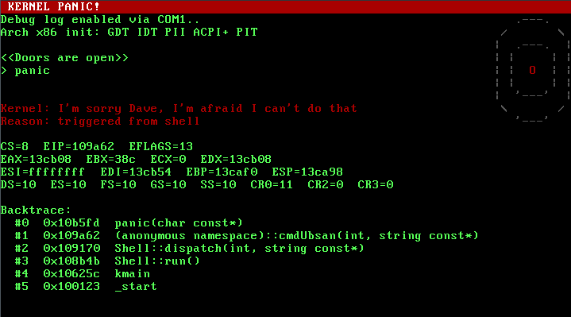

## Doors

A 32-bit x86 hobby OS written in C++20, booted via GRUB/Multiboot.

The name is the recursive acronym "Doors of Open Run-time Systems".



### Features

- Boot, VGA TTY (80x25), `printf()` with variadic templates
- PS/2 keyboard (Set 1, shift/ctrl/alt/caps, ring buffer, line editing)
- PIT timer at 1000 Hz with uptime tracking
- Heap allocator (best-fit free-list, coalescing, 16-byte aligned)
- Preemptive round-robin kernel task scheduler (8 slots, 20 ms quantum)
- Snake game running as a scheduled task with VGA save/restore
- Shell with 14 built-in commands
- IDT/PIC with exception handlers and IRQ routing
- GDT (5 entries, PL0/PL3)
- CMOS/RTC, CPU detection, memory map
- Serial debug (COM1) and kernel UBSan (optional)

### Shell commands

`uptime`, `cpuinfo`, `meminfo`, `clear`, `help`, `halt`, `reboot`, `datetime`, `echo`, `ticks`,
`heap`, `snake`, `testsched`, `tasks`, `kill`, `panic`, `ubsan`/`ubsanp` (only when
`-DKERNEL_UBSAN=ON`)

### Prerequisites

i386-elf cross-compiler (build with `./scripts/bootstrap.sh`),
CMake 3.25+, Ninja, QEMU, GRUB + mtools.

### Build & Run

```
cmake --preset default
cd build/default
ninja
ninja test
ninja run
```

Other presets: `release`, `serial-debug`, `sanitize` (see `cmake --list-presets`).
