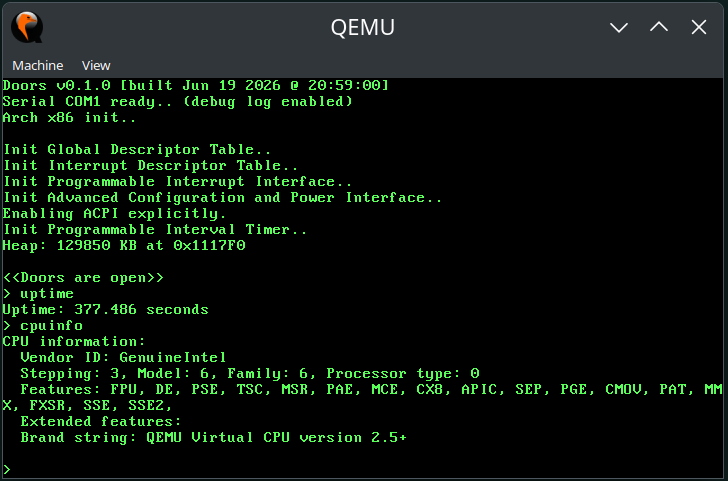

# Doors

The name is the recursive acronym "Doors of Open Run-time Systems".

## Concept

The challenge was to write a 32-bit OS using C++20 (originally C++11) aiming for paged memory,
exceptions/interrupts support, and a keyboard driver. Then dropping into a simple shell for
processing simple commands like querying CPU information, uptime, memory available/used,
start/stop/monitor timers etc. Maybe being able to play a simple "Snake" game or similar.



## What it does

| Subsystem | Status | Details |
|---|---|---|
| **Boot** | Working | Multiboot-compliant, GRUB-loaded, 32-bit protected mode |
| **VGA TTY** | Working | 80×25 text mode |
| **printf** | Working | Variadic template with `%d %u %x %s %c %b` support |
| **Keyboard** | Working | Set 1 scancodes, shift/ctrl/alt/caps, 256-byte ring buffer, line editing (backspace, Ctrl+U) |
| **PIT timer** | Working | 1000 Hz, uptime ms/s queries |
| **Heap** | Working | Best-fit free-list allocator, coalescing, 16-byte aligned |
| **Shell** | Working | Prompt loop, tokenizer, command dispatch (11 built-in commands) |
| **IDT / PIC** | Working | Exception handlers (0, 6, 11–14), IRQ 0 (timer) + IRQ 1 (keyboard), PIC remapped |
| **GDT** | Working | 5 entries: null, code/data PL0, code/data PL3 |
| **CMOS/RTC** | Working | Time-of-day read at boot |
| **CPU detection** | Working | Vendor, brand string, feature flags |
| **Memory map** | Working | Multiboot memory map, upper/lower KB detection |
| **Serial debug** | Optional | COM1 mirror for `printf` (conflicts with `KERNEL_UBSAN`) |
| **UBSan (kernel)** | Optional | Instrument kernel with `-fsanitize=undefined`, panics via COM1 + VGA |
| **Test suite** | Working | ~200+ host-compiled doctest cases, ASan/UBSan enabled |

### Shell commands

```
uptime    - Show system uptime
cpuinfo   - Show CPU vendor, brand, features
meminfo   - Show memory information and heap stats
clear     - Clear the terminal
help      - List all commands with descriptions
halt      - Halt the system
reboot    - Reboot via PS/2 controller pulse
datetime  - Show current date/time from CMOS
echo      - Echo text back to the terminal
ticks     - Show raw PIT tick count
heap      - Show heap allocator statistics
```

### Things to look into later

- **Software timers**: `timer start/stop/check/wait/list/free` commands
- **Blinking cursor**: VGA hardware cursor enable/position
- **Scrollback buffer**: Page Up/Down to browse output history
- **Snake game**: VGA text-mode game
- **Floating-point support**: SSE/x87 context save/restore ([IEEE-754](https://en.wikipedia.org/wiki/IEEE_754-1985))
- **Multi-task scheduling**: Round-robin or cooperative
- **Hard disk driver**: ATA PIO, FAT32/EXT2 filesystem
- **Mouse driver**: PS/2 mouse
- **USB drivers**: xHCI or UHCI

## Prerequisites

| Tool | Purpose | Install |
|---|---|---|
| i386-elf cross-compiler (GCC 14.2.0) | Builds the kernel | `./scripts/bootstrap.sh` |
| CMake 3.25+ | Build system | `sudo apt install cmake` |
| Ninja | Build tool | `sudo apt install ninja-build` |
| Clang or GCC | Host compiler for tests | `sudo apt install clang` |
| QEMU | Run the kernel | `sudo apt install qemu-system-x86` |
| GRUB + mtools | ISO builds | `sudo apt install grub-pc-bin grub-common mtools` |

QEMU and GRUB are optional and only needed for `run`, `run-iso`, and `iso` targets.

### Cross-compiler

The i386-elf cross-compiler (GCC 14.2.0 + Binutils 2.42) must be built before configuring CMake. The
bootstrap script downloads, builds, and installs it into `bootstrap/`:

```sh
./scripts/bootstrap.sh
```

This takes a few minutes. Once built, CMake detects it automatically.

## Build

```sh
# Configure: creates build/default/
cmake --preset default

# Build kernel, libc++, and tests
cd build/default
ninja

# Run tests
ninja test

# Run in QEMU
ninja run

# Build a bootable ISO
ninja iso

# Build ISO and run in QEMU
ninja run-iso
```

### Serial debug preset

Mirrors all `printf` output to `doors.log` via QEMU's COM1 serial port:

```sh
cmake --preset serial-debug
cd build/serial-debug
ninja run   # doors.log is written to build/serial-debug/doors.log
```

### Sanitize preset

Builds tests with `AddressSanitizer` and `UndefinedBehaviorSanitizer`:

```sh
cmake --preset sanitize
cd build/sanitize
ninja test
```

ASan and UBSan are supported by both Clang and GCC. Any violation aborts the test
immediately with a detailed report.

Available presets: `cmake --list-presets`

### Cleaning

```sh
ninja clean   # removes all build artifacts including the test build
```

### Distribution archives

```sh
ninja zip    # build/default/doors.zip
ninja tgz    # build/default/doors.tgz
ninja bz2    # build/default/doors.bz2
ninja xz     # build/default/doors.xz
```

## CMake Options

| Option | Default | Description |
|---|---|---|
| `SERIAL_DEBUG` | `OFF` | Mirror `printf` to COM1 (captured in `doors.log` by QEMU) |
| `BUILD_TESTS` | `ON` | Build tests and include them in the default (`all`) target |
| `VERBOSE_BUILD` | `OFF` | Show raw compiler/linker commands during build |
| `HOST_CXX_COMPILER` | _(auto)_ | Host C++ compiler for tests; auto-detects clang++ then g++ |
| `SANITIZERS` | _(none)_ | Sanitizers for host-compiled tests (e.g. `address;undefined`) |
| `KERNEL_UBSAN` | `OFF` | Instrument the kernel with UBSan (handlers panic via direct UART I/O) |
| `CAPS_LOCK_IS_CTRL` | `OFF` | Remap Caps Lock to Left Control |

Pass options at configure time:

```sh
cmake --preset default -DVERBOSE_BUILD=ON
cmake --preset default -DBUILD_TESTS=OFF
cmake --preset default -DHOST_CXX_COMPILER=g++
cmake --preset default -DSANITIZERS="address;undefined"
cmake --preset default -DKERNEL_UBSAN=ON
```

## References

- [Intel i386 manuals](http://www.intel.com/content/www/us/en/processors/architectures-software-developer-manuals.html)
- [Logix's i386 reference](http://www.logix.cz/michal/doc/i386/)
- [Modern Operating Systems](http://www.amazon.com/Modern-Operating-Systems-Andrew-Tanenbaum/dp/013359162X/) (book)
- [Operating Systems Principles](http://www.amazon.com/Operating-Systems-Principles-Lubomir-Bic/dp/0130266116) (book)
- [osdev.org](http://wiki.osdev.org/Main_Page)
